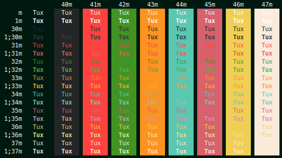

# Plasma

All my Plasma5 customizations

## Contents

### Aurorae themes

<table border="0">
  <tr>
    <td>
      <a href="aurorae/themes/ActiveDuoTone">
        
        
Active DuoTone

      </a>
    </td>
    <td></td>
    <td></td>
  </tr>
</table>

### Plasma Color Schemes

<table border="0">
  <tr>
    <td>
      <a href="color-schemes/BreezeDarker.colors">
        
        
Breeze Darker

      </a>
    </td>
    <td>
      <a href="#">
        
        
[WIP] Pika

      </a>
    </td>
    <td></td>
  </tr>
</table>

### Konsole Color Schemes

<table border="0">
  <tr>
    <td>
      <a href="konsole/Tailwind.colorscheme">
        
        
Tailwind Konsole

      </a>
    </td>
    <td>
      <a href="konsole/Lorikeet.colorscheme">
        
        
Lorikeet Konsole

      </a>
    </td>
    <td>
      <a href="konsole/Girgit.colorscheme">
        
        
Girgit Konsole

      </a>
    </td>
  </tr>
</table>

### Plasmiods

<table border="0">
  <tr>
    <td>
      <a href="plasma/plasmoids/com.github.aryan02420.neonclock">
        
        
Neon Clock

      </a>
    </td>
    <td>
      <a href="#">
        
        
[WIP] Clock of Fifths

      </a>
    </td>
    <td>
      <a href="#">
        
        
[WIP] MaterialYou Widgets

      </a>
    </td>
  </tr>
</table>

### Wallpapers

<table border="0">
  <tr>
    <td>
      <a href="plasma/wallpapers/com.github.aryan02420.hunyangoAccent">
        
        
Hunyango Active

      </a>
    </td>
    <td>
      <a href="#">
        
        
[WIP] Hunyango Plus

      </a>
    </td>
    <td></td>
  </tr>
</table>

## Changelog

This project does not follow Semantic Versioning. All scripts/plasmiods evolve according to my needs and tastes. Only breaking and major changes are listed here

### Planned

  - HunyangoActive will be replaced by HunyangoPlus
### Released
